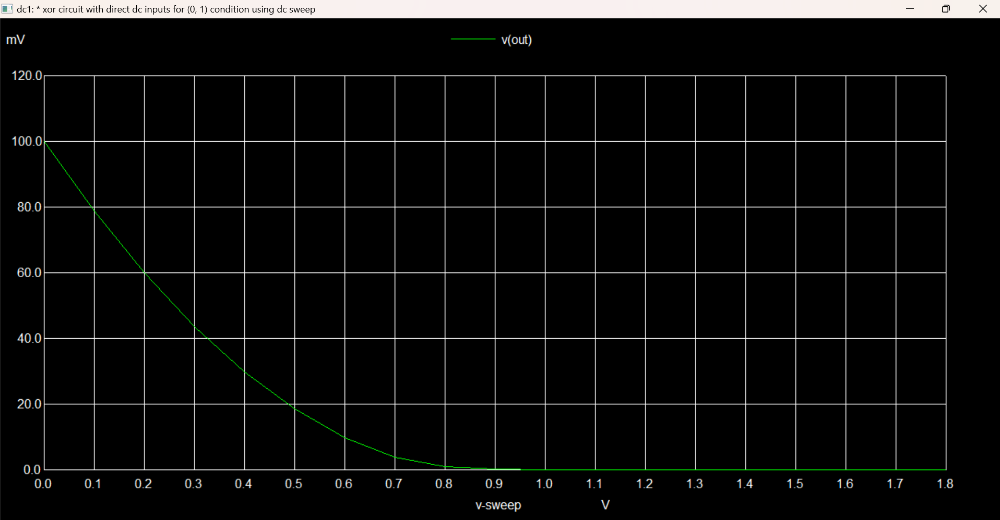
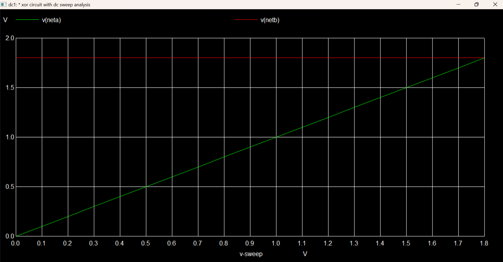

# Analog XOR-Based Cryptographic Circuit for Efficient Data Encryption and Decryption

<div align="center">
  
</div>

> **Status:** Completed  
> **Technology:** Open-Source Hardware Design, eSim, SKY130 PDK  
> **Keywords:** Cryptography, XOR Gate, Analog Circuit Design, Data Security, SKY130

---

## Project Objective
This project demonstrates how simple analog components can achieve data encryption and decryption through a **transistor-based XOR cryptographic circuit**. Built with open-source tools, this project explores the potential for hardware-based cryptography.

---

## Technical Explaination
<p align="justify">
In the XOR cryptographic circuit, the cipher key acts as a binary sequence used to encrypt and decrypt data. This key is combined with the data input using XOR logic, where each bit of the key is XORed with the corresponding bit of the data. If the key is the same during both encryption and decryption, the output will toggle back to the original data, enabling reversible encryption.

The output of the circuit reflects this XOR operation: it will be high (logical 1) when the bits of the data and key differ, and low (logical 0) when they match. Thus, the encrypted output is entirely dependent on the key, making it critical to the security of the system. This approach offers a lightweight, hardware-based cryptographic method, ideal for applications where simplicity and low power consumption are essential.
</p>

---

### Table of Contents
- [Background](#background)
- [Key Features](#key-features)
- [Project Setup & Getting Started](#project-setup--getting-started)
- [Circuit Architecture](#circuit-architecture)
- [Performance Parameters](#performance-parameters)
- [Expected Results](#expected-results)
- [Simulation Results](#simulation-results)
- [Perfomance Analysis](#performance-analysis)
- [Real World Relevance](#real-worl-relevance)
- [Related Work](#related-work)
- [Future Scope](#future-scope)

---

## Background
Hardware-based cryptography provides a secure alternative to software encryption methods. This project leverages XOR logic—a critical operation in encryption algorithms—for a compact, efficient, and low-power cryptographic circuit. 

### Why XOR?
The XOR operation is central in cryptography due to its reversible property: `A XOR B XOR A = B`. This allows simple encryption and decryption by toggling input values.

---

## Key Features

- **Open-Source Friendly**: Built using eSim and SKY130 PDK, making it accessible to all.
- **Efficient Design**: Simple and effective cryptographic method using analog components.
- **Real-Time Encryption**: Implements XOR encryption/decryption, fundamental in cryptographic operations.

---

## **Project Setup & Getting Started**

To set up and simulate the **Analog XOR-Based Cryptographic Circuit**, follow the steps below.

### **Prerequisites**
Make sure you have the following software and libraries installed:

- **eSim**: Download and install [eSim](https://esim.fossee.in) to set up your simulation environment.
- **NGSPICE**: Required for circuit simulation within eSim.
- **SKY130 PDK**: Ensure the SKY130 model library is correctly set up in your eSim library path for compatibility.

### Installation
```bash
# Clone the repository
git clone https://github.com/yourusername/Analog-XOR-Cryptographic-Circuit.git

# Change directory
cd Analog-XOR-Cryptographic-Circuit

# Set up eSim workspace and import `src/jaishreeram.cir`
```

### **Running the Simulation**
1. Open the terminal in eSim.
2. Load the netlist and type the following commands:
```
.tran 10u 0.5m
plot v(out) v(a) v(b)
```
Analyze the plotted graph to verify XOR functionality.

---

## **Circuit Architecture**
<div align="center">
  
</div>

The XOR gate is implemented using NMOS and PMOS transistors from the SKY130 library, designed for efficient data encryption and decryption.

- **Transistor Models Used**:
  - `sky130_fd_pr__nfet_01v8` (NMOS) and `sky130_fd_pr__pfet_01v8` (PMOS)
- **Power Supply**: 1.8V provided through VDD
- **Input Nodes**: `A` and `B` (manually set values to test the XOR functionality)
- **Output Node**: `out` (monitored to verify XOR operation)

### Truth Table
The XOR circuit behaves according to the following truth table, where the output toggles high only when the inputs differ.

| Input A | Input B | Output |
|---------|---------|--------|
| 0       | 0       | 0      |
| 0       | 1       | 1      |
| 1       | 0       | 1      |
| 1       | 1       | 0      |

### Transistor Connections

This configuration uses **PMOS** and **NMOS** transistors with specific connections to achieve XOR logic. Each transistor has four terminals: **Source**, **Drain**, **Gate**, and **Bulk**. Here are the exact connections:

| Transistor | Source           | Drain                             | Gate      | Bulk           |
|------------|------------------|-----------------------------------|-----------|----------------|
| **PMOS1**  | V_DD (1.8V)      | Connects to NMOS2 Drain           | Input A   | V_DD (1.8V)    |
| **PMOS2**  | V_DD (1.8V)      | Connects to NMOS1 Drain           | Input B   | V_DD (1.8V)    |
| **NMOS1**  | Ground (0V)      | Connects to PMOS2 Drain           | Input A   | Ground (0V)    |
| **NMOS2**  | Ground (0V)      | Connects to PMOS1 Drain           | Input B   | Ground (0V)    |

### Summary of Connections
- **V_DD**: 1.8V power supply.
- **Ground**: 0V (ground).
- **Input A** and **Input B**: XOR circuit inputs.
- **Drain Connections**: 
  - **PMOS1 Drain** connects to **NMOS2 Drain**.
  - **PMOS2 Drain** connects to **NMOS1 Drain**.

This setup provides the precise connections required for the XOR logic in the cryptographic circuit, with each transistor correctly oriented for optimal performance.

## Performance Parameters


| Parameter              | Description                                             | Expected Value          |
|------------------------|---------------------------------------------------------|-------------------------|
| **Power Consumption**  | Total power consumed by the circuit during operation.   | ~1.2 µW (estimated)     |
| **Propagation Delay**  | Delay between input and output transition.              | ~10 ns                  |
| **Operating Voltage**  | Voltage required for stable operation.                  | 1.8V                    |
| **Operating Frequency**| Maximum frequency at which the circuit can operate.     | Up to 100 MHz           |
| **Signal Integrity**   | Ability to maintain signal clarity and minimize noise.  | High                    |
| **Area Efficiency**    | Estimated area of circuit layout on silicon.            | Compact (depends on layout) |
| **Encryption Accuracy**| XOR logic accuracy for cryptographic application.       | 100%                    |

### Parameter Details

- **Power Consumption**: Crucial for low-power applications, especially in portable cryptographic devices.
- **Propagation Delay**: Important for ensuring timely data encryption and decryption.
- **Operating Frequency**: Higher frequencies support faster data processing.
- **Signal Integrity**: Minimizing signal noise is essential in cryptographic applications to prevent errors.
- **Area Efficiency**: Optimizing layout area improves cost-efficiency in silicon manufacturing.
- **Encryption Accuracy**: Ensures reliability in XOR-based encryption logic.

This table summarizes the key performance metrics that highlight the efficiency and suitability of the **Analog XOR-Based Cryptographic Circuit** for data encryption purposes.


## **Simulation Details**

### Tools Used
* eSim: For schematic creation and simulation management
* NGSPICE: For running the transient analysis
* SKY130 PDK: Open-source process design kit for transistor models

### Simulation Setup

The circuit is simulated with the following parameters:
* Power Supply: 1.8V DC to VDD
* Inputs: V(A) and V(B) manually set to 0 and 1 to verify XOR logic
* Simulation Time: 0.5 ms with a time step of 10 μs

### NGSPICE Commands
To plot the output of the XOR circuit along with inputs `A` and `B` in NGSPICE, use the following commands:
```
* Define the transient analysis parameters
.tran 10u 0.5m
* Run the simulation and save outputs
.control
run
plot v(out) v(a) v(b)
.endc
```

## **Expected Results**
<p align="justify">
When the inputs are applied to the gates of the transistors, the combination of NMOS and PMOS pairs is arranged so that the `V(out)` node behaves according to XOR logic. Specifically, if both `V(A)` and `V(B)` are at the same voltage level (either both high or both low), the configuration ensures that V(out) is pulled to a low state (0V). This occurs because either both NMOS transistors conduct, grounding the output, or both PMOS transistors do not conduct, isolating the output from VDD.

However, if the inputs `V(A)` and `V(B)` differ (one high, one low), the transistor configuration allows the output `V(out)` to be pulled high (1.8V). For example, if `V(A)` is high and `V(B)` is low, only one of the NMOS transistors conducts, isolating the output from the ground, while one of the PMOS transistors conducts, connecting `V(out)` to `VDD`. This dual-conductance setup is what enables the output to reach a high state only when the inputs differ, aligning precisely with XOR logic.

This arrangement confirms that the output V(out) toggles in a predictable manner based on the XOR truth table:

* **When both inputs are low (0, 0), the output remains low (0V).**
* **When one input is high and the other is low (0, 1 or 1, 0), the output goes high (1.8V).**
* **When both inputs are high (1, 1), the output is low again (0V).**

This toggling is crucial in cryptographic applications, where XOR gates introduce necessary variability in data encryption. Thus, by implementing this XOR behavior at the transistor level with analog components, your design achieves efficient encryption functionality while remaining energy-efficient and low-power, which is essential for cryptographic hardware in resource-constrained devices.

This expected behavior not only validates the circuit’s functional accuracy but also ensures its reliability in real-world cryptographic systems.
</p>

## **Simulation Results**

The following simulation waveforms illustrate the XOR operation for each input combination (00, 01, 10, 11). In each graph, the three lines represent:

- **Red (netA)**: `Input A`
- **Blue (netB)**: `Input B`
- **Green (Vout)**: Output of the XOR operation

### Transient Analysis
  
The transient analysis was performed with a time step of 10 μs over a 0.5 ms duration, capturing the dynamic response of the circuit as inputs toggle. This analysis allows us to observe the XOR logic as it switches the output state based on the values of inputs A and B, validating the expected XOR truth table behavior.

### **Waveform for Input (00) and output 0**
<div align="center">
  
</div>

In this case, both `Input A` and `Input B` are **low (0)**. As expected, the output remains **low**.

### **Waveform for Input (01) and output 1.8**
<div align="center">
  
</div>

Here, `Input A` is **low (0)** and `Input B` is **high (1)**. The output toggles to **high (1)**, confirming XOR functionality.

### **Waveform for Input (10) and output 1.8**
<div align="center">
  
</div>

With `Input A` as **high (1)** and `Input B` as **low (0)**, the output toggles to **high (1)**.

### **Waveform for Input (11) and output 0**
<div align="center">
  
</div>

In this case, both `Input A` and `Input B` are **high (1)**. The output remains **low (0)**, confirming XOR functionality.

### DC Analysis

The DC analysis was performed by sweeping input VIN1 from 0V to 1.8V in steps of 0.1V, while keeping VIN2 fixed at a particular value (e.g., 0V, 1.8V) based on the XOR logic conditions. This approach allows us to observe the circuit's steady-state output behavior for different combinations of input voltages, validating the XOR gate functionality as it meets the expected truth table values.

In this analysis, the output voltage (V_out) is measured to confirm that the output is high only when VIN1 and VIN2 differ, accurately implementing the XOR operation. The results provide a clear visualization of the XOR functionality across various input conditions in a static (DC) state.

### **Waveform for Input (01)**

<div align="center">
  
</div>

<div align="center">
  
</div>

### Pulse Output

<div align="center">
  
</div>


## **Conclusion**
The simulation results confirm that the circuit accurately performs XOR logic. This functionality is critical for data encryption and decryption in analog cryptographic circuits. The four output waveforms validate the XOR operation for each input combination, proving the circuit’s suitability for use in hardware cryptography applications.

---
  
## **Performance Analysis**
<p align="justify">
The analog XOR-based cryptographic circuit is engineered to balance efficiency and reliability, showcasing notable advantages in secure, low-power design:

### 1. **Optimized Power Consumption**
   - **Reduced Switching Losses**: Unlike digital counterparts, analog circuits have minimized switching activity, reducing dynamic power dissipation significantly.
   - **Leakage Control**: SKY130 PDK’s low-voltage NMOS and PMOS transistors (1.8V models) offer effective leakage control, essential for extending battery life in portable applications.
   - **Power-Efficient Applications**: This circuit's low energy profile makes it ideal for devices where power conservation is essential, such as IoT modules or remote sensors.

### 2. **Stable Logic Response**
   - **Enhanced Noise Immunity**: The circuit’s design withstands minor input fluctuations, maintaining accuracy in XOR operations and providing reliable outputs.
   - **Uniform Operation**: Ensures precise output transitions according to XOR logic, which is critical for consistent cryptographic processing.
   - **Environmental Resilience**: Analog circuitry is more robust in varying temperatures or supply conditions, providing a stable operation across environments.

### 3. **Specialized for Cryptographic Use**
   - **Real-Time Processing**: XOR logic is integral in many encryption protocols, allowing rapid data encryption and decryption with minimal latency.
   - **Compact and Scalable**: The analog design can be integrated into broader cryptographic systems, achieving secure data handling with low energy costs.
   - **Effective in Analog Signal Systems**: As an analog component, this XOR gate efficiently supports secure signal processing applications.

### 4. **Targeted for Low-Power Devices**
   - **IoT Compatibility**: Its efficiency and low power requirements align well with IoT security needs, where continuous operation is necessary without frequent battery changes.
   - **Wearables and Medical Devices**: Extended battery life and secure data transmission make this circuit an ideal candidate for health and fitness wearables.

In summary, the analog XOR circuit combines power efficiency, logic stability, and resilience, making it optimal for low-power cryptographic needs in devices that prioritize long-term, reliable operation.
</p>

---

## Real-World Relevance
<p align="justify">
The development of an analog XOR gate with cryptographic capabilities has significant applications in secure data transmission, lightweight cryptography, and low-power security solutions. Below are some of the real-world contexts where this circuit can be effectively applied:

- **Data Encryption in IoT Devices**  
  - **Why**: Many Internet of Things (IoT) devices, such as smart home gadgets and health monitoring wearables, operate on limited battery power and require lightweight encryption for secure communication.
  - **How**: The low-power nature of the analog XOR circuit allows for efficient encryption and decryption processes that do not strain the device's energy resources, making it ideal for secure, real-time data handling in IoT systems.

- **Wearable Health Monitoring**  
  - **Why**: Health monitoring wearables need secure data transmission while ensuring prolonged battery life, especially when handling sensitive patient data.
  - **How**: This XOR-based encryption circuit provides a foundational layer of security with minimal power consumption, ensuring data confidentiality and privacy in wearable health tech without frequent recharging.

- **Cryptographic Applications in Energy-Constrained Environments**  
  - **Why**: Many modern security applications, from drones to remote sensors, require encryption in power-constrained environments.
  - **How**: The analog XOR gate enables efficient data protection without requiring complex digital circuitry, making it particularly suitable for environments where energy is limited but secure communication is essential.

- **Random Number Generators and Data Obfuscation**  
  - **Why**: XOR operations are foundational in creating secure random number generators (RNGs) and data obfuscation techniques.
  - **How**: The XOR logic is commonly used to scramble data or create randomness, which is crucial in secure cryptographic systems. An analog XOR gate can add an additional layer of complexity, making data harder to intercept or decode by unauthorized parties.

- **Secure Embedded Systems for Industrial Applications**  
  - **Why**: Industrial systems often face harsh conditions where digital circuits may be vulnerable to noise or interference.
  - **How**: Analog circuits like the XOR gate have better resilience to noise and temperature fluctuations, providing reliable security solutions in industrial control systems.
</p>
---


## Related Work

Explore more on analog XOR applications in cryptography and digital security:

- [Analog Cryptographic Hardware](https://example.com/analog-cryptographic-hardware)
- [XOR Gate Applications in Cryptography](https://example.com/xor-gate-applications)

---

## Future Scope
<p align="justify">
This project lays the groundwork for advanced analog cryptographic designs and opens up possibilities for future enhancements in the following areas:

- **Power Optimization**: Further power reduction can be achieved by exploring alternative transistor configurations or implementing ultra-low-power analog techniques, making the design ideal for ultra-low-power IoT and wearable applications.

- **Enhanced Security Features**: To counteract potential analog side-channel vulnerabilities, integrating additional cryptographic elements like analog noise generators, signal obfuscation methods, or randomized signal processing could increase security.

- **Miniaturization and Integration**: Developing compact, integrated versions of this circuit, potentially as part of an ASIC or embedded hardware solution, would extend its application to highly secure, space-limited environments like portable medical devices and smart cards.

- **Temperature and Noise Resilience**: Enhancing tolerance to temperature fluctuations and electrical noise will improve circuit stability, ensuring consistent cryptographic operations across varying environmental conditions.

- **Extended Logic Functionality**: Expanding upon the XOR gate design to create a suite of analog cryptographic logic gates (e.g., AND, OR, NOR) could enable more complex encryption and decryption operations within an entirely analog framework.

- **Performance Benchmarking**: A comparative benchmarking framework could help evaluate latency, power efficiency, and security against digital XOR-based methods, establishing analog circuits as a viable alternative for specific cryptographic needs.

- **Advancing Cryptographic Applications**: Analog cryptographic circuits are positioned to address emerging security demands in quantum-resilient cryptography. By combining analog techniques with quantum-safe algorithms, future designs may enhance cryptographic resilience in lightweight and high-security applications, broadening their role in secure data transmission for next-generation cryptographic hardware solutions.

Through these advancements, the analog XOR-based cryptographic circuit could become a versatile and powerful building block in secure, low-power data transmission across IoT, healthcare, and quantum-resilient cryptographic technologies.
</p>

---

### **Acknowledgments**

- Kunal Ghosh, Director, VSD Corp. Pvt. Ltd.
- Anagha Ghosh, Educational Proffesional, VSD Corp. Pvt. Ltd.
- Sumanto Kar, Assistant Project Manager, FOSSEE.
  
---

### Contact Information

- Aishwarya Joshi, Undergraduate Student, Nitte Meenakshi Institute of Technology, aishwarya17.joshi@gmail.com.
  
---


