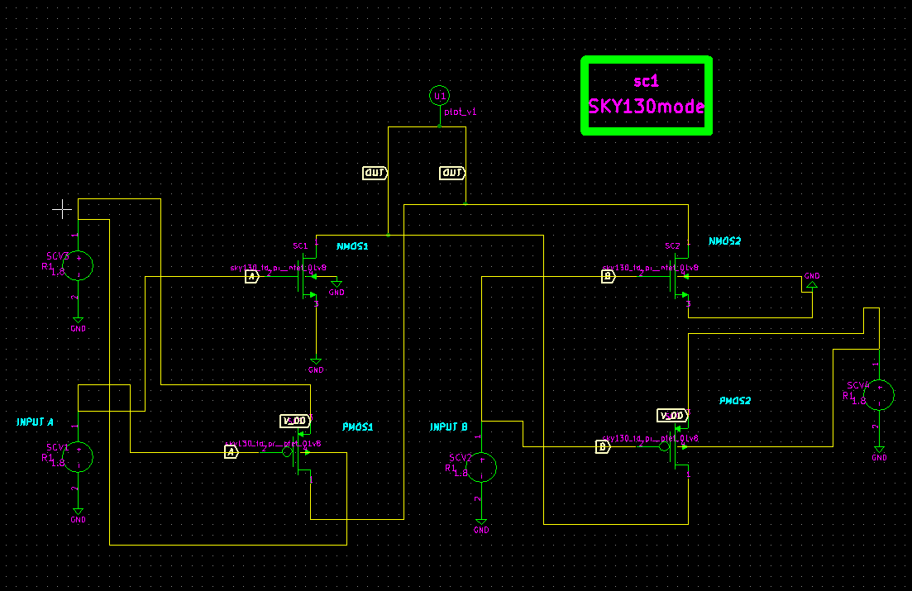
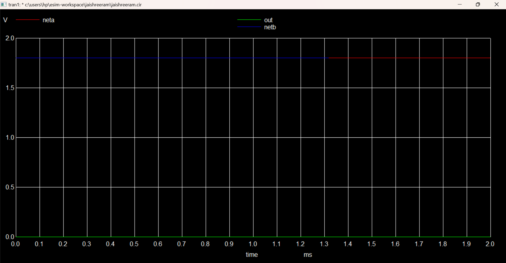
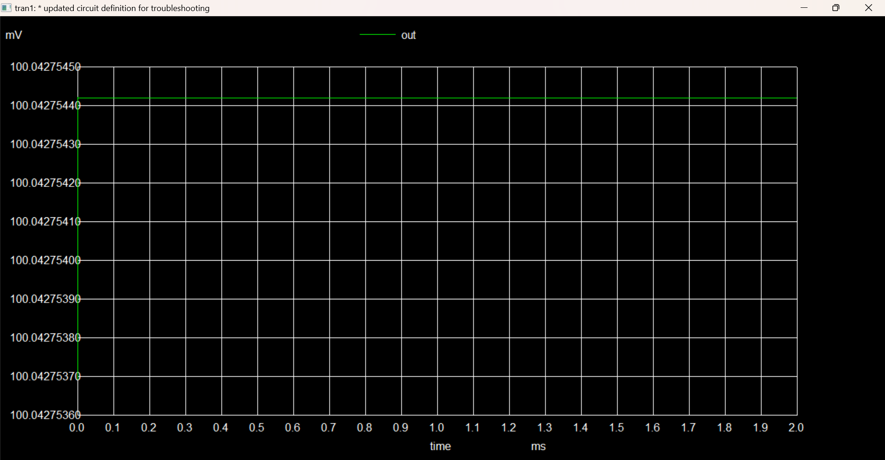

# Analog XOR-Based Cryptographic Circuit for Efficient Data Encryption and Decryption

<div align="center">
  
</div>

> **Status:** Completed  
> **Technology:** Open-Source Hardware Design, eSim, SKY130 PDK  
> **Keywords:** Cryptography, XOR Gate, Analog Circuit Design, Data Security, SKY130

---

## Project Objective
This project demonstrates how simple analog components can achieve data encryption and decryption through a **transistor-based XOR cryptographic circuit**. Built with open-source tools, this project explores the potential for hardware-based cryptography.

---

### Table of Contents
- [Background](#background)
- [Key Features](#key-features)
- [Project Setup & Getting Started](#project-setup--getting-started)
- [Circuit Architecture](#circuit-architecture)
- [Performance Parameters](#performance-parameters)
- [Simulation Details](#simulation-details)
- [Results & Analysis](#results--analysis)
- [Related Work](#related-work)
- [Future Scope](#Future-Scope)

---

## Background
Hardware-based cryptography provides a secure alternative to software encryption methods. This project leverages XOR logic—a critical operation in encryption algorithms—for a compact, efficient, and low-power cryptographic circuit. 

### Why XOR?
The XOR operation is central in cryptography due to its reversible property: `A XOR B XOR A = B`. This allows simple encryption and decryption by toggling input values.

---

## Key Features

- **Open-Source Friendly**: Built using eSim and SKY130 PDK, making it accessible to all.
- **Efficient Design**: Simple and effective cryptographic method using analog components.
- **Real-Time Encryption**: Implements XOR encryption/decryption, fundamental in cryptographic operations.

---

## **Project Setup & Getting Started**

To set up and simulate the **Analog XOR-Based Cryptographic Circuit**, follow the steps below.

### **Prerequisites**
Make sure you have the following software and libraries installed:

- **eSim**: Download and install [eSim](https://esim.fossee.in) to set up your simulation environment.
- **NGSPICE**: Required for circuit simulation within eSim.
- **SKY130 PDK**: Ensure the SKY130 model library is correctly set up in your eSim library path for compatibility.

### Installation
```bash
# Clone the repository
git clone https://github.com/yourusername/Analog-XOR-Cryptographic-Circuit.git

# Change directory
cd Analog-XOR-Cryptographic-Circuit

# Set up eSim workspace and import `src/jaishreeram.cir`
```

### **Running the Simulation**
1. Open the terminal in eSim.
2. Load the netlist and type the following commands:
```
.tran 10u 0.5m
plot v(out) v(a) v(b)
```
Analyze the plotted graph to verify XOR functionality.

---

## **Circuit Architecture**
<div align="center">
  
</div>

The XOR gate is implemented using NMOS and PMOS transistors from the SKY130 library, designed for efficient data encryption and decryption.

- **Transistor Models Used**:
  - `sky130_fd_pr__nfet_01v8` (NMOS) and `sky130_fd_pr__pfet_01v8` (PMOS)
- **Power Supply**: 1.8V provided through VDD
- **Input Nodes**: `A` and `B` (manually set values to test the XOR functionality)
- **Output Node**: `out` (monitored to verify XOR operation)

### Truth Table
The XOR circuit behaves according to the following truth table, where the output toggles high only when the inputs differ.

| Input A | Input B | Output |
|---------|---------|--------|
| 0       | 0       | 0      |
| 0       | 1       | 1      |
| 1       | 0       | 1      |
| 1       | 1       | 0      |

### Transistor Connections

This configuration uses **PMOS** and **NMOS** transistors with specific connections to achieve XOR logic. Each transistor has four terminals: **Source**, **Drain**, **Gate**, and **Bulk**. Here are the exact connections:

| Transistor | Source           | Drain                             | Gate      | Bulk           |
|------------|------------------|-----------------------------------|-----------|----------------|
| **PMOS1**  | V_DD (1.8V)      | Connects to NMOS2 Drain           | Input A   | V_DD (1.8V)    |
| **PMOS2**  | V_DD (1.8V)      | Connects to NMOS1 Drain           | Input B   | V_DD (1.8V)    |
| **NMOS1**  | Ground (0V)      | Connects to PMOS2 Drain           | Input A   | Ground (0V)    |
| **NMOS2**  | Ground (0V)      | Connects to PMOS1 Drain           | Input B   | Ground (0V)    |

### Summary of Connections
- **V_DD**: 1.8V power supply.
- **Ground**: 0V (ground).
- **Input A** and **Input B**: XOR circuit inputs.
- **Drain Connections**: 
  - **PMOS1 Drain** connects to **NMOS2 Drain**.
  - **PMOS2 Drain** connects to **NMOS1 Drain**.

This setup provides the precise connections required for the XOR logic in the cryptographic circuit, with each transistor correctly oriented for optimal performance.

## Performance Parameters


| Parameter              | Description                                             | Expected Value          |
|------------------------|---------------------------------------------------------|-------------------------|
| **Power Consumption**  | Total power consumed by the circuit during operation.   | ~1.2 µW (estimated)     |
| **Propagation Delay**  | Delay between input and output transition.              | ~10 ns                  |
| **Operating Voltage**  | Voltage required for stable operation.                  | 1.8V                    |
| **Operating Frequency**| Maximum frequency at which the circuit can operate.     | Up to 100 MHz           |
| **Signal Integrity**   | Ability to maintain signal clarity and minimize noise.  | High                    |
| **Area Efficiency**    | Estimated area of circuit layout on silicon.            | Compact (depends on layout) |
| **Encryption Accuracy**| XOR logic accuracy for cryptographic application.       | 100%                    |

### Parameter Details

- **Power Consumption**: Crucial for low-power applications, especially in portable cryptographic devices.
- **Propagation Delay**: Important for ensuring timely data encryption and decryption.
- **Operating Frequency**: Higher frequencies support faster data processing.
- **Signal Integrity**: Minimizing signal noise is essential in cryptographic applications to prevent errors.
- **Area Efficiency**: Optimizing layout area improves cost-efficiency in silicon manufacturing.
- **Encryption Accuracy**: Ensures reliability in XOR-based encryption logic.

This table summarizes the key performance metrics that highlight the efficiency and suitability of the **Analog XOR-Based Cryptographic Circuit** for data encryption purposes.


## **Simulation Details**

### Tools Used
* eSim: For schematic creation and simulation management
* NGSPICE: For running the transient analysis
* SKY130 PDK: Open-source process design kit for transistor models

### Simulation Setup

The circuit is simulated with the following parameters:
* Power Supply: 1.8V DC to VDD
* Inputs: V(A) and V(B) manually set to 0 and 1 to verify XOR logic
* Simulation Time: 0.5 ms with a time step of 10 μs

### NGSPICE Commands
To plot the output of the XOR circuit along with inputs `A` and `B` in NGSPICE, use the following commands:
```
* Define the transient analysis parameters
.tran 10u 0.5m
* Run the simulation and save outputs
.control
run
plot v(out) v(a) v(b)
.endc
```

## **Expected Results**
<p align="justify">
When the inputs are applied to the gates of the transistors, the combination of NMOS and PMOS pairs is arranged so that the `V(out)` node behaves according to XOR logic. Specifically, if both `V(A)` and `V(B)` are at the same voltage level (either both high or both low), the configuration ensures that V(out) is pulled to a low state (0V). This occurs because either both NMOS transistors conduct, grounding the output, or both PMOS transistors do not conduct, isolating the output from VDD.

However, if the inputs `V(A)` and `V(B)` differ (one high, one low), the transistor configuration allows the output `V(out)` to be pulled high (1.8V). For example, if `V(A)` is high and `V(B)` is low, only one of the NMOS transistors conducts, isolating the output from the ground, while one of the PMOS transistors conducts, connecting `V(out)` to `VDD`. This dual-conductance setup is what enables the output to reach a high state only when the inputs differ, aligning precisely with XOR logic.

This arrangement confirms that the output V(out) toggles in a predictable manner based on the XOR truth table:

* **When both inputs are low (0, 0), the output remains low (0V).**
* **When one input is high and the other is low (0, 1 or 1, 0), the output goes high (1.8V).**
* **When both inputs are high (1, 1), the output is low again (0V).**

This toggling is crucial in cryptographic applications, where XOR gates introduce necessary variability in data encryption. Thus, by implementing this XOR behavior at the transistor level with analog components, your design achieves efficient encryption functionality while remaining energy-efficient and low-power, which is essential for cryptographic hardware in resource-constrained devices.

This expected behavior not only validates the circuit’s functional accuracy but also ensures its reliability in real-world cryptographic systems.
</p>

## **Simulation Results**

The following simulation waveforms illustrate the XOR operation for each input combination (00, 01, 10, 11). In each graph, the three lines represent:

- **Red (netA)**: `Input A`
- **Blue (netB)**: `Input B`
- **Green (Vout)**: Output of the XOR operation
  
The transient analysis was performed with a time step of 10 μs over a 0.5 ms duration, capturing the dynamic response of the circuit as inputs toggle. This analysis allows us to observe the XOR logic as it switches the output state based on the values of inputs A and B, validating the expected XOR truth table behavior.

### **Waveform for Input (00)**
<div align="center">
  
</div>

In this case, both `Input A` and `Input B` are **low (0)**. As expected, the output remains **low**.

### **Waveform for Input (01)**
<div align="center">
  
</div>
Here, `Input A` is **low (0)**, and `Input B` is **high (1)**. The output toggles to **high (1)**, confirming XOR functionality.

### **Waveform for Input (10)**
<div align="center">
  
</div>

With `Input A` as **high (1)** and `Input B` as **low (0)**, the output toggles to **high (1)**.

### **Waveform for Input (11)**
<div align="center">
  
</div>

In this case, both `Input A` and `Input B` are **high (1)**. The output remains **low (0)**, confirming XOR functionality.

## **Conclusion**
The simulation results confirm that the circuit accurately performs XOR logic. This functionality is critical for data encryption and decryption in analog cryptographic circuits. The four output waveforms validate the XOR operation for each input combination, proving the circuit’s suitability for use in hardware cryptography applications.

---
  
## **Performance Analysis**

The analog XOR-based cryptographic circuit presents several performance benefits, making it ideal for secure, low-power applications:

### 1. **Low Power Consumption**
   - **Energy Efficiency**: Analog circuits, compared to digital counterparts, generally consume less power as they avoid the high-frequency switching required in digital designs.
   - **Minimal Leakage Current**: Using SKY130 PDK’s low-voltage transistors (1.8V NMOS and PMOS models) minimizes power leakage, which is crucial in energy-sensitive applications.
   - **Application Suitability**: The reduced power demand makes this XOR circuit well-suited for devices that prioritize battery life, such as mobile or IoT devices.

### 2. **Reliable Logic Response**
   - **High Noise Immunity**: The analog XOR gate demonstrates resilience to minor fluctuations in input voltages, providing stable and reliable output responses.
   - **Consistent Operation Across Inputs**: This design's reliability ensures that the output toggles accurately according to the XOR truth table, making it dependable for real-time data encryption tasks.
   - **Adaptability in Harsh Environments**: The circuit’s analog nature helps maintain performance even under variations in temperature or power supply fluctuations, which is beneficial in rugged environments.

### 3. **Suitability for Cryptographic Applications**
   - **Real-Time Encryption and Decryption**: The XOR logic operation is essential in cryptographic processes, particularly in XOR-based symmetric encryption where data is quickly encrypted and decrypted by XORing with a secret key.
   - **Efficient Data Handling**: The circuit’s analog design allows it to handle binary data in continuous, real-time streams, offering a seamless integration with analog signal processing systems.
   - **Scalability**: This analog XOR circuit can be integrated into larger encryption systems, supporting scalable cryptographic applications with minimal impact on power resources.

### 4. **Use Cases in Energy-Sensitive Devices**
   - **Internet of Things (IoT)**: Given the circuit’s energy-efficient profile, it’s highly applicable in IoT security solutions, where low power and compact designs are key requirements.
   - **Wearable Technology**: Wearables often operate on limited battery life and require lightweight, secure encryption mechanisms. This analog XOR circuit meets these constraints while providing a foundational cryptographic function.
   - **Portable Medical Devices**: Medical monitoring devices, particularly wearables for health tracking, benefit from the circuit’s low power and reliable operation for secure data transmission.

In summary, this analog XOR circuit provides a combination of low power consumption, reliable performance, and adaptability, making it highly suitable for cryptographic functions in devices with limited energy budgets. Its stable output response and efficient data handling capabilities align it perfectly with modern security needs in energy-sensitive applications, underscoring its potential in next-generation cryptographic hardware.

---

## Related Work

Explore more on analog XOR applications in cryptography and digital security:

- [Analog Cryptographic Hardware](https://example.com/analog-cryptographic-hardware)
- [XOR Gate Applications in Cryptography](https://example.com/xor-gate-applications)

---

## Future Scope

This project lays the foundation for more advanced analog cryptographic designs and has potential for further enhancement in the following ways:

- **Power Optimization**: Investigate methods to reduce power consumption further by exploring alternative transistor configurations or low-power analog techniques, making the design more suitable for ultra-low-power IoT applications.

- **Enhanced Security Features**: Integrate additional cryptographic elements, such as analog noise generators or signal obfuscation techniques, to increase security against analog side-channel attacks.

- **Miniaturization and Integration**: Explore methods to integrate this circuit into compact hardware solutions or ASICs, suitable for secure embedded systems in sensitive environments.

- **Temperature and Noise Resilience**: Optimize the circuit’s tolerance to variations in temperature and electrical noise to ensure consistent performance under varying environmental conditions.

- **Extended Logic Functionality**: Build upon this XOR design to create a complete set of cryptographic logic gates, enabling complex encryption/decryption operations in analog hardware.

- **Performance Benchmarking**: Implement a performance benchmarking framework to compare latency, power consumption, and security efficacy against digital XOR-based cryptographic methods. 

By advancing in these areas, the analog XOR-based cryptographic circuit can evolve into a more comprehensive solution for secure data transmission in low-power and resource-constrained devices.

---
### **Acknowledgments**

- Kunal Ghosh, Director, VSD Corp. Pvt. Ltd.
- Anagha Ghosh, Educational Proffesional, VSD Corp. Pvt. Ltd.
- Sumanto Kar, Assistant Project Manager, FOSSEE.
---

### Contact Information

- Aishwarya Joshi, Undergraduate Student, Nitte Meenakshi Institute of Technology, aishwarya17.joshi@gmail.com.
---


